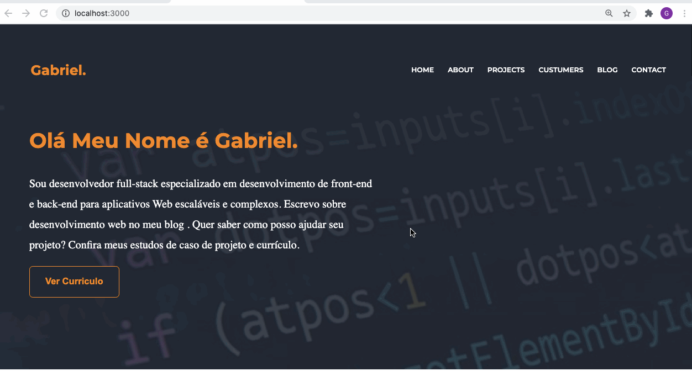

<html>
   <body>
  <h1 align="center">Developer</h1>
<h4 align="center">
   
</h4>

  <a href="#tecnologias">Tecnologias</a>&nbsp;&nbsp;&nbsp;|&nbsp;&nbsp;&nbsp;
  <a href="#page_facing_up-sobre">Sobre</a>&nbsp;&nbsp;&nbsp;|&nbsp;&nbsp;&nbsp;
  <a href="#-como-usar">Como usar</a>&nbsp;&nbsp;&nbsp;|&nbsp;&nbsp;&nbsp;
  <a href="#pencil-autor">Autor</a>

## :wrench: Tecnologias

<!--EXEMPLO:-->
- [React](https://pt-br.reactjs.org/)
- [styled Components](https://styled-components.com)
- [aos](https://michalsnik.github.io/aos)
- [react Scrol](https://www.npmjs.com/package/react-scroll)

## :page_facing_up: Sobre

Desenvolver esse projeto para cadastra os pedidos dos livros dos alunos no banco, 
caso ele queira modificar os seus pedidos ele poderia modificar e excluir, com base nisso desenvolver
o front-end em react utilizando os hooks useContext, useState deixando a nossa  aplicação mais
moderna e entendível e passando as responsabilidades para o nossos componentes fazer a chamada para Api.
               
## 💻 Como usar

- Clone o projeto: `git clone https://github.com/Gabriel200395/cadastro-livro.git`
- Entrar na pasta do projeto: `cd cadastro-livro`
- Iniciar a aplicação: `npm start`
- baixe na aplicação: `npm install`

Irá abrir uma página no browser (se não abrir, vá até [http://localhost:8080](http://localhost:8080/)).
## :pencil: Autor

<table>
  <tr>
    <td align="center"><a href="https://github.com/Gabriel200395"> <b>Gabriel Souza</b></a> </td>
  <tr>
</table>

